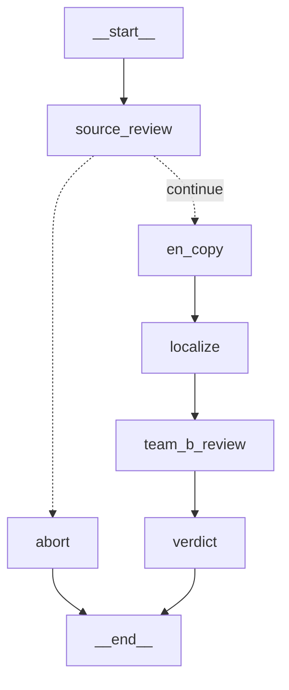

# 演示手册 · 给研发看「本地真实部署 + 跑通」

> 已在本机验证:桩模式 100% 通;真实模式用 `gpt-5.5`(经 huoshenai.net 中转)端到端跑通。

## 0. 一句话

「我们把 UX Writer + 母语审校两个环节做成了 LangGraph 编排:Team A 出稿 → Team B 四维走查 → 终裁/回流。程序化护栏用代码,创译/审校用大模型;无 key 走桩验证 wiring,配 key 接真实模型。**换模型只改 `.env`,不动逻辑**。」

## 1. 现场命令(照念)

```bash
cd /Users/hemingqi/Documents/trae_projects/1/localization-agents/langgraph_impl

# ① 先跑桩(秒出,讲清编排链路)——不需要任何 key
mv .env .env.bak 2>/dev/null; ./.venv/bin/python run_demo.py; mv .env.bak .env 2>/dev/null

# ② 再跑真实模型(读 .env 里的 key)
./.venv/bin/python run_demo.py

# 用自己的文案
./.venv/bin/python run_demo.py --submission ../data/my_submission.json
```

⚠️ 必须用 `./.venv/bin/python`,别用 `python3`(系统的是 3.9,跑不了 langgraph)。

## 2. 图结构(可投屏)



- **Team A**:`source_review`(审中文,阻断则 abort 回退人工)→ `en_copy`(英文 SoT)→ `localize`(逐语言创译 + 程序化约束校验)
- **Team B**:`team_b_review`(语言/术语/文化/视觉 四维)→ `verdict`(终裁 + 路由 + 回流候选)

## 3. 讲解要点(跑的时候说)

1. **职责分离 + 对抗式审校**:Team B 独立于 Team A,默认挑错,不为出稿方背书。
2. **程序化护栏 vs 大模型**(对应研发关心的可控性):
   - 代码硬校验:长度 / 占位符 / RTL / 品牌词(`do_not_translate`)/ 终裁规则 —— **不信 LLM 自评**。
   - 大模型:创译、母语地道度、文化合规判断。
3. **硬规则 vs 软杠杆**:品牌词违规 = 失败;TM(翻译记忆)差异 = 仅提示(新译文可以更好,不因和历史不同就判死)。
4. **人在环(HITL)**:营销/法务/支付/文化敏感、或标了「需确认」的,一律升级人工,不自动放行。
5. **换模型零成本**:Claude / DeepSeek / Kimi / 通义 / 智谱,只改 `.env` 的 `base_url + model`。
6. **失败兜底**:真实模型偶发返回坏 JSON / 网络抖动,单条自动降级到桩并标注,demo 不崩。

## 4. 已知行为(别被问住)

- **source_review 可能 abort 掉含歧义的中文**(如「已抢光」是商品还是活动?、营销双关)。这是"垃圾进垃圾出"的护栏,**是功能不是 bug**——正好演示"源文不清晰会被拦下回退人工"。
- **文化/合规审校较严**:库存类"稀缺/紧迫"文案可能被判合规风险。想让它通过,在 `scene` 里注明"数量为真实实时值",能显著减少误报。
- **延迟**:真实模型每条约 30–60 秒(`gpt-5.5` 带推理)。3 条 5 语言约 3 分钟。建议现场**只跑 1–2 条**,或边跑边讲架构。

## 5. 演示节奏建议

1. 先跑**桩**(秒出),讲清 Team A→Team B 的链路和护栏。
2. 再跑**真实**的 1–2 条:一条走通→approved→可回流 TM;一条演示护栏(abort 或 HITL 升级)。
3. 收尾:强调可观测/Schema 校验/并行 fan-out 是研发要接的工程化(见 PRODUCT-PLAN 的 R1–R12)。

## 6. 演示后务必做

🔑 **作废/重置当前 API key**——它在配置对接过程中被明文传过,演示完在厂商后台 rotate 一把新的,只填进 `.env`。
